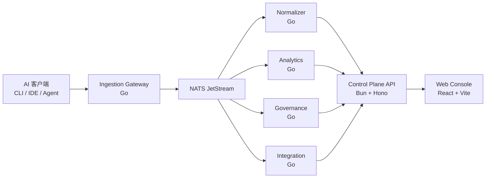

# AgentLedger

面向企业的 AI 使用治理平台，用于统一采集、审计、预算与分析团队的 AI CLI/IDE 会话数据。

[](https://github.com/MisonL/AgentLedger/actions/workflows/ci.yml)

## 核心价值

AgentLedger 面向企业研发与平台团队，目标是把分散在 AI CLI 与 AI IDE 的会话行为统一纳入治理闭环：

- 可采集：统一接入多客户端会话与使用量数据。
- 可审计：完整保留关键操作与治理动作审计记录。
- 可预算：按租户/组织/用户/模型设置阈值与告警。
- 可分析：提供热力图、会话检索、模型与成本统计。

## 当前功能

| 能力域 | 当前可用能力 |
| --- | --- |
| 会话与使用量 | 使用热力图（usage heatmap）、daily/monthly/models/sessions 聚合、会话详情与事件列表 |
| Source 管理 | source 新增/查询/删除、连通性测试、同步任务管理 |
| 预算治理 | budgets 读写、阈值分级、告警与状态流转 |
| 集成分发 | 支持 `alert/weekly` 双事件；`webhook` 原样转发，`wecom/dingtalk/feishu` 使用 `text` 模板消息 |
| 回调链路 | governance -> integration -> control-plane callback 闭环 |
| Web Console | Dashboard / Sessions / Analytics / Sources / Pricing 最小可用页面 |
| 工程质量 | Bun + Go 混合 monorepo、基础 CI、脚本化门禁 |

## 架构



## 仓库结构

<details>
<summary>目录结构（精简）</summary>

```text
apps/
  control-plane/
  web-console/
services/
  ingestion-gateway/ normalizer/ analytics/ governance/ integration/ puller/ archiver/
packages/
  contracts/ proto/ gen/
clients/
  agent/
scripts/
docs/
deploy/
```

</details>

## 快速开始

### 1. 环境准备

- Bun `>= 1.3`
- Go `>= 1.24`
- CI 侧固定 Bun `1.3.9`（来自 `packageManager`），并使用 `bun install --frozen-lockfile`

### 2. 安装依赖

```bash
make install
```

### 3. 本地质量检查

```bash
make format
make lint
make test
make build
```

### 4. 本地运行

```bash
bun --cwd apps/control-plane run dev
bun --cwd apps/web-console run dev
```

### 5. 回调链路联调（建议先跑）

```bash
bun run check:callback-stream-binding
bun run test:callback-chain-targeted
bun run test:e2e-governance-callback-chain
```

关键变量：`INTEGRATION_CALLBACK_STREAM`、`INTEGRATION_CALLBACK_SUBJECT`（或 `INTEGRATION_CALLBACK_TOPIC`）、`INTEGRATION_CALLBACK_DURABLE`、`CONTROL_PLANE_BASE_URL`、`INTEGRATION_CALLBACK_PATH`、`INTEGRATION_CALLBACK_SECRET`。详细说明见 `docs/13-环境变量参考.md`。

## 质量门禁

| 门禁目标 | 命令入口 | 对应脚本 |
| --- | --- | --- |
| TypeScript 类型检查 | `bun run lint` | `scripts/lint.sh` -> `scripts/ts-check.sh` |
| 测试门禁 | `bun run test` | `scripts/test.sh` |
| 构建门禁 | `bun run build` | `scripts/build.sh` |
| 覆盖率门禁 | `bun run test:coverage` | `scripts/test-coverage.sh` + `scripts/check-coverage-threshold.sh` |
| 文本规范（LF/BOM） | `bun run check:text-normalization` | `scripts/check-text-normalization.sh` |
| 支持矩阵一致性 | `bun run check:support-matrix` | `scripts/check-support-matrix.ts` |
| 回调配置绑定一致性 | `bun run check:callback-stream-binding` | `scripts/check-callback-stream-binding.sh` |

### Coverage 阈值（当前执行）

1. `services/ingestion-gateway`: `>= 70%`
2. `services/puller`: `>= 70%`
3. `services/integration`: `>= 75%`
4. `apps/control-plane`: `All files` 行覆盖率 `>= 80%`

## 里程碑

| 里程碑 | 目标 |
| --- | --- |
| M1 工程底座 | Monorepo、基础 API/Web、脚本化质量检查 |
| M2 采集与解析 MVP | P0 客户端接入与统一事件模型 |
| M3 统计与搜索 MVP | 热力图、usage 聚合、会话检索 |
| M4 预算与治理 | 预算阈值、告警、回调闭环 |
| M5 稳定与发布 | 三平台构建、文档与验收闭环 |

详见 `docs/05-交付计划与验收策略.md`。

## 贡献

1. 在变更前阅读 `docs/` 内相关设计与验收文档。
2. 提交前至少执行：`bun run lint && bun run test && bun run build`。
3. 涉及客户端矩阵变更时，同步更新 `docs/09-主流AI客户端支持矩阵.md`。
4. 涉及回调链路或环境变量变更时，同步更新 `docs/13-环境变量参考.md`。
5. PR 描述需包含：变更范围、验证步骤、风险与回滚策略。
