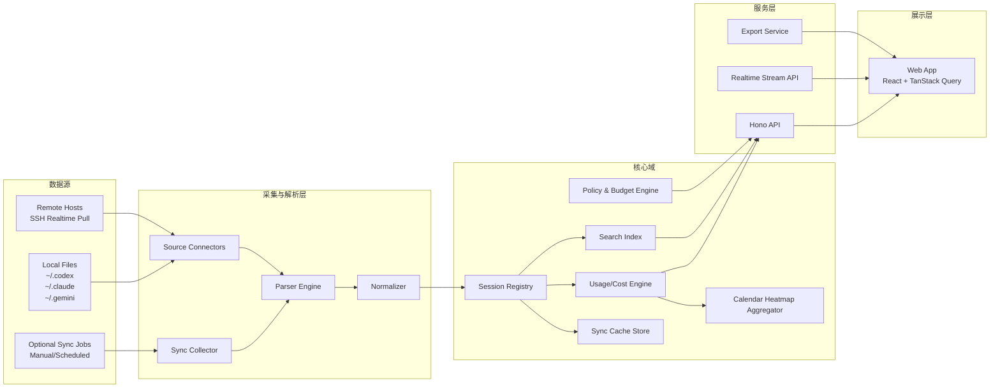

# AgentLedger 软件架构设计（SAD）

- 文档版本：v1.0
- 更新时间：2026-03-01
- 关联文档：`01-功能需求规格说明.md`

## 1. 架构目标

1. 支持主流 AI CLI 与 AI IDE（含国产客户端）统一接入与分析。
2. 支持本地 + 远程主机（SSH）会话读取。
3. 满足“远程默认实时读取，支持可选只读同步缓存”约束。
4. 具备可演进的插件化连接器架构。

## 2. 总体架构

## 3. 技术选型（Bun 优先）

## 3.1 后端

1. 运行时：`Bun`（TypeScript）。
2. API 框架：`Hono`（轻量、Bun 友好、支持中间件与 WebSocket）。
3. 数据库：`SQLite`（通过 `bun:sqlite`，WAL 模式）。
4. 搜索：SQLite FTS5（MVP）；后续可扩展为外部全文索引。

## 3.2 前端

1. 框架：`React`。
2. 数据层：`TanStack Query`（缓存、失效、后台刷新）。
3. 图表：ECharts（或同级可替换方案）。

## 3.3 远程访问

1. 通过 `Bun.spawn()` 调用系统 `ssh` 执行远程读取命令。
2. 实时模式使用流式 stdout 解析，按增量窗口读取。
3. 可选同步模式执行单向只读同步到本地缓存（手动/定时）。
4. 禁止触发远程写操作命令。

## 3.4 选型依据（来自 Context7）

1. Bun 官方能力包含 `Bun.spawn()`、stdout 流式读取、`bun:sqlite` 与 WAL 实践。
2. Hono 提供 Bun 适配、路由中间件与 WebSocket 支持。
3. TanStack Query 提供查询缓存、失效刷新与预取机制，适合统计看板数据模型。

## 4. 模块设计

## 4.1 Source Connectors

1. `LocalConnector`：扫描本地目录并增量读取。
2. `SshRealtimeConnector`：通过 SSH 实时拉取远程数据。
3. `SshSyncConnector`：通过 SSH 单向同步远程会话到本地缓存。
4. 统一输出 `RawEventEnvelope`。

## 4.2 Parser Engine

1. `CliParsers`：Codex/Claude/Gemini/Aider/OpenCode/Qwen/Kimi/TRAE CLI/CodeBuddy CLI。
2. `IdeParsers`：Cursor、VS Code（Cline/Roo/Continue/Copilot Chat）、TRAE IDE、Windsurf、通义灵码、CodeBuddy IDE。
3. 通过 `ParserRegistry` 动态注册，避免核心域硬编码客户端分支。

## 4.3 Normalizer

1. 将不同源字段归一到 `NormalizedEvent`。
2. 补充上下文字段：`source_id`、`host`、`workspace`、`provider`、`model`。
3. 输出到会话注册中心与统计引擎。

## 4.4 Usage/Cost Engine

1. 统计维度：day/month/session/model/source/project。
2. 成本口径：优先原始日志成本，缺失则按定价表估算。
3. 支持 cache/read/write/reasoning 分项。

## 4.5 Search Index

1. 会话与消息片段写入 FTS。
2. 支持关键词 + 过滤器复合查询。
3. 结果可追溯到原始 `session_id + source`。

## 4.6 Calendar Heatmap Aggregator

1. 生成 GitHub Contributions 风格的日历热力图数据。
2. 支持指标切换：`tokens` / `cost` / `sessions`。
3. 支持按客户端类型（CLI/IDE）、具体工具、主机过滤。
4. 支持按时区重算日边界，避免跨时区统计偏移。

## 5. 远程访问与同步设计（关键）

## 5.1 设计原则

1. 默认优先实时读取，减少缓存滞后。
2. 支持可选同步缓存，用于远程离线降级查询。
3. 同步仅单向只读，不允许回写远程源。
4. 默认不做全量镜像，同步范围可配置。

## 5.2 读取模式

1. **统计模式**：远程执行轻量聚合脚本，仅返回 token/cost 汇总。
2. **检索模式**：远程过滤后返回命中片段。
3. **详情模式**：按 `session_id` 拉取特定会话片段。

## 5.3 同步模式

1. **手动同步**：由用户触发，立即拉取指定时间窗。
2. **定时同步**：按 Source 周期执行增量同步。
3. **混合模式**：查询优先实时；失败时回退缓存。

## 5.4 连接策略

1. 短连接优先，失败自动重连。
2. 并发连接池（按主机限流）。
3. 每次命令设置超时与输出大小上限。

## 5.5 安全策略

1. SSH 公钥认证 + host key 校验。
2. 命令白名单（只允许 `find/cat/jq/awk` 等读操作模板）。
3. 所有远程命令审计记录（host、command hash、耗时、结果大小）。

## 6. 数据存储架构

1. `SQLite` 存储：
   - 配置与数据源。
   - 标准化事件与聚合结果。
   - 同步缓存元数据与任务记录。
   - 索引与审计日志。
2. 默认不保存远程完整原始日志；开启同步时可保存必要片段与标准化事件（可配置保留窗口）。

## 7. API 分层

1. `/api/sources/*`：数据源管理与健康检查。
2. `/api/sessions/*`：会话搜索、详情读取。
3. `/api/usage/*`：daily/monthly/session/model 统计。
4. `/api/usage/calendar`：GitHub 风格日历热力图数据。
5. `/api/budgets/*`：预算、阈值、告警状态。
6. `/api/exports/*`：CSV/JSON 导出。

## 8. 部署架构

## 8.1 单机模式（MVP）

1. `agentledger-api`（Bun + Hono）。
2. `agentledger-web`（React）。
3. `agentledger.db`（SQLite）。

## 8.2 团队模式（后续）

1. API 与 Web 分离部署。
2. 外接 PostgreSQL / 专用搜索引擎。
3. 引入集中式鉴权与多租户策略。

## 9. 可观测性

1. 指标：采集成功率、解析错误率、查询延迟、SSH 失败率。
2. 日志：结构化 JSON，按 trace_id 关联。
3. 审计：管理操作与远程命令调用全记录。

## 10. 容错与降级

1. 单源失败降级：显示部分结果 + 错误告警。
2. 远程超时降级：返回“已完成源 + 未完成源列表”。
3. 统计降级：优先返回缓存结果并标记时间戳。

## 11. 架构决策记录（ADR 摘要）

1. ADR-001：运行时选 Bun（性能 + 全工具链一体）。
2. ADR-002：远程默认实时读取，支持可选只读同步缓存。
3. ADR-003：MVP 搜索使用 SQLite FTS5，后续按规模演进。
4. ADR-004：成本计算采用“双轨口径”（原始成本优先 + 定价估算补齐）。
